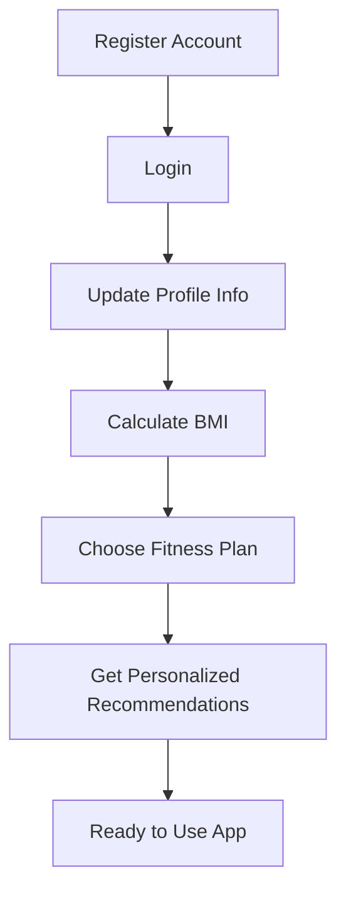
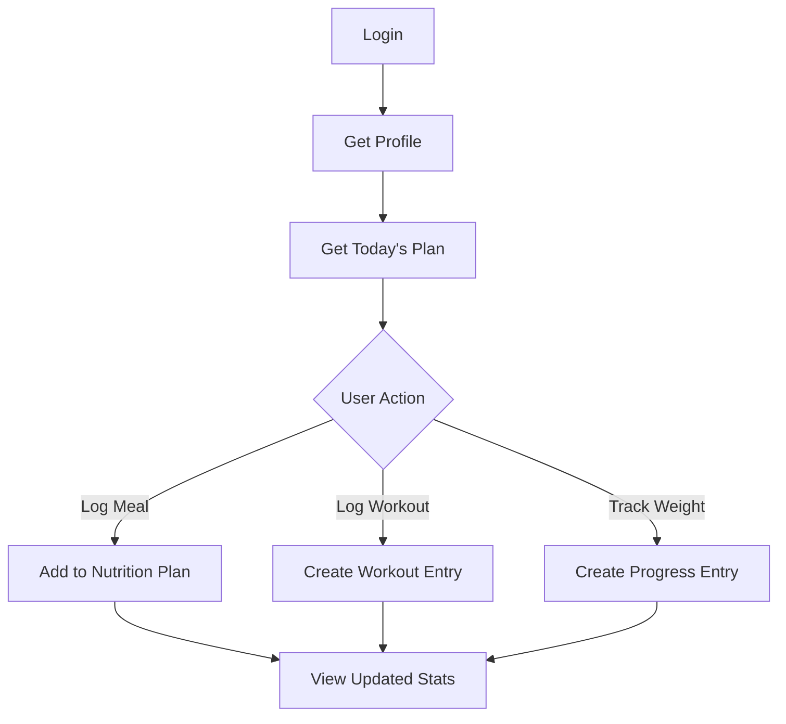
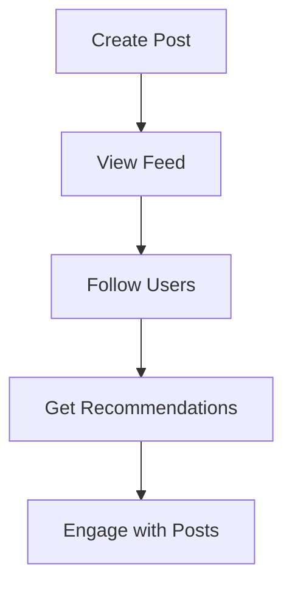
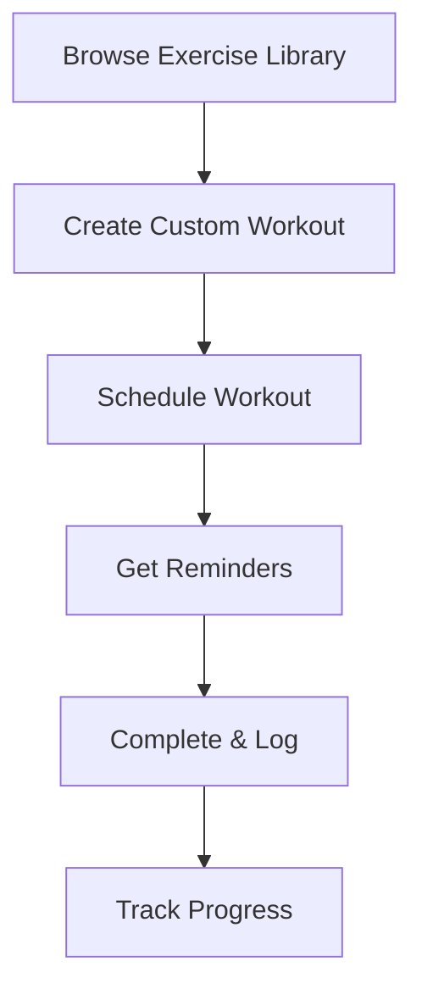
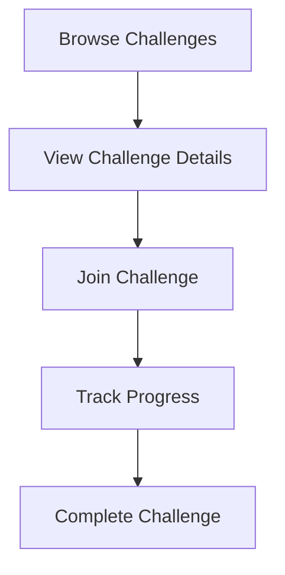

# FitLife Planner - API Workflow Documentation

**Complete Integration Guide for Client Developers**

---

## Table of Contents

1. [Quick Start](#quick-start)
2. [Core User Flows](#core-user-flows)
3. [Endpoint Reference](#endpoint-reference)
4. [Integration Patterns](#integration-patterns)
5. [Error Handling](#error-handling)

---

## Quick Start

### Base URL

```
http://localhost:5000
```

### Authentication

All protected endpoints require a Bearer token in the Authorization header:

```http
Authorization: Bearer {token}
```

### Response Format

All endpoints return a standardized response:

```json
{
  "success": true|false,
  "message": "Description of result",
  "statusCode": "OK|Created|BadRequest|Unauthorized|NotFound",
  "data": { ... },
  "headers": {}
}
```

---

## Core User Flows

### 🎯 Flow 1: Complete User Onboarding

**Goal:** New user registration → Profile setup → BMI assessment → Personalized plan



#### Step-by-Step Implementation

**Step 1: Register Account**

```http
POST /account
Content-Type: application/json

{
  "username": "john_doe",
  "email": "john@example.com",
  "password": "SecurePass123!"
}
```

**Response:**

```json
{
  "success": true,
  "message": "Successfully created user",
  "statusCode": "Created",
  "data": {
    "id": "550e8400-e29b-41d4-a716-446655440000",
    "username": "john_doe",
    "email": "john@example.com"
  }
}
```

**Step 2: Login**

```http
POST /auth/login
Content-Type: application/json

{
  "email": "john@example.com",
  "password": "SecurePass123!"
}
```

**Response:**

```json
{
  "success": true,
  "message": "Login successful",
  "statusCode": "OK",
  "data": {
    "token": "eyJhbGciOiJIUzI1NiIs...",
    "refreshToken": "eyJhbGciOiJIUzI1NiIs...",
    "userId": "550e8400-e29b-41d4-a716-446655440000"
  }
}
```

> **💡 Client Action:** Save `token` and `refreshToken` to local storage/secure storage

**Step 3: Update Profile**

```http
PUT /profile
Authorization: Bearer {token}
Content-Type: application/json

{
  "displayName": "John Doe",
  "avatarUrl": "https://example.com/avatar.jpg",
  "birthDate": "1995-05-15T00:00:00Z",
  "gender": 0,
  "bio": "Fitness enthusiast"
}
```

**Response:**

```json
{
  "success": true,
  "message": "Successfully updated Profile",
  "statusCode": "OK",
  "data": {
    "profileId": "660e8400-e29b-41d4-a716-446655440000",
    "displayName": "John Doe",
    "avatarUrl": "https://example.com/avatar.jpg"
  }
}
```

**Step 4: Calculate BMI**

```http
POST /bmi/calculate
Authorization: Bearer {token}
Content-Type: application/json

{
  "heightCm": 175,
  "weightKg": 70
}
```

**Response:**

```json
{
  "success": true,
  "message": "BMI calculated successfully",
  "statusCode": "Created",
  "data": {
    "bmi": 22.86,
    "bmiRecordID": "770e8400-e29b-41d4-a716-446655440000",
    "assessment": "Normal weight"
  }
}
```

> **💡 Client Action:** Display BMI result and category to user

**Step 5: Choose Fitness Plan**

```http
POST /bmi/me
Authorization: Bearer {token}
Content-Type: application/json

{
  "practiceLevel": 2,
  "activityFactor": 1.55
}
```

**Request Parameters:**

- `practiceLevel`: 0 = Beginner, 1 = Intermediate, 2 = Advanced
- `activityFactor`: 1.2 = Sedentary, 1.375 = Light, 1.55 = Moderate, 1.725 = Very Active, 1.9 = Extra Active

**Response:**

```json
{
  "success": true,
  "message": "Successfully retrieved BMI",
  "statusCode": "OK",
  "data": {
    "bmiRecordId": "770e8400-e29b-41d4-a716-446655440000",
    "dailyCalories": 2450,
    "goalPlan": {
      "goal": "Maintain Weight",
      "targetWeight": 70,
      "weeklyChange": 0
    },
    "nutrition": {
      "protein": 175,
      "carbs": 306,
      "fat": 68
    },
    "practiceLevel": 2,
    "activityFactor": 1.55
  }
}
```

> **💡 Client Action:** Display personalized nutrition plan and daily calorie target

**Step 6: Get Personalized Recommendations**

```http
GET /api/recommendations/personalized-plan
Authorization: Bearer {token}}
```

**Response:**

```json
{
  "success": true,
  "message": "Personalized plan generated",
  "statusCode": "OK",
  "data": {
    "currentBMI": 22.86,
    "targetCalories": 2450,
    "recommendedWorkouts": [...],
    "mealSuggestions": [...]
  }
}
```

---

### 🔄 Flow 2: Daily Usage Pattern

**Goal:** Login → View dashboard → Track progress → Log activities



#### Implementation

**1. Login & Get Profile**

```http
POST /auth/login
# ... (same as onboarding)

GET /profile
Authorization: Bearer {token}
```

**2. Get Today's Nutrition Plan**

```http
GET /nutrition-plans/me
Authorization: Bearer {token}
```

**3. Log a Meal**

```http
POST /nutrition-plans/{planId}/foods
Authorization: Bearer {token}
Content-Type: application/json

{
  "foodItemId": "880e8400-e29b-41d4-a716-446655440000",
  "servings": 1.5,
  "mealType": "lunch"
}
```

**4. Log a Workout**

```http
POST /workouts
Authorization: Bearer {token}
Content-Type: application/json

{
  "name": "Morning Run",
  "description": "5K run in the park",
  "durationMinutes": 30,
  "caloriesBurned": 250,
  "exercises": "[{\"name\": \"Running\", \"duration\": 30}]",
  "scheduledFor": "2024-12-05T07:00:00Z"
}
```

**5. Track Weight Progress**

```http
POST /progress
Authorization: Bearer {token}
Content-Type: application/json

{
  "type": "weight",
  "value": 69.5,
  "unit": "kg",
  "notes": "Morning weight",
  "recordedAt": "2024-12-05T08:00:00Z"
}
```

---

### 👥 Flow 3: Social Features

**Goal:** Create content → Follow users → Engage with community



#### Implementation

**1. Create a Post**

```http
POST /post
Authorization: Bearer {token}
Content-Type: application/json

{
  "title": "Hit my goal!",
  "content": "Just completed my first 5K run! 🏃‍♂️",
  "media": "https://example.com/photo.jpg"
}
```

**2. Get All Posts (Feed)**

```http
GET /post/all?PageNumber=1&PageSize=20
Authorization: Bearer {token}
```

**3. Follow a User**

```http
POST /api/followers/{userId}/follow
Authorization: Bearer {token}
```

**4. Get Follower Stats**

```http
GET /api/followers/stats
Authorization: Bearer {token}
```

**Response:**

```json
{
  "success": true,
  "data": {
    "followersCount": 45,
    "followingCount": 32,
    "mutualFriendsCount": 12
  }
}
```

---

### 🏋️ Flow 4: Fitness Planning

**Goal:** Browse exercises → Create workout → Schedule → Track completion



#### Implementation

**1. Browse Exercise Library**

```http
GET /exercise-library?PageNumber=1&PageSize=20
Authorization: Bearer {token}
```

**2. Search for Specific Exercise**

```http
GET /exercise-library/search?query=bench&PageNumber=1&PageSize=10
Authorization: Bearer {token}
```

**3. Create Custom Workout**

```http
POST /workouts
Authorization: Bearer {token}
Content-Type: application/json

{
  "name": "Upper Body Strength",
  "description": "Chest and triceps focus",
  "durationMinutes": 60,
  "caloriesBurned": 300,
  "exercises": "[
    {\"name\": \"Bench Press\", \"sets\": 4, \"reps\": 10},
    {\"name\": \"Tricep Dips\", \"sets\": 3, \"reps\": 12}
  ]",
  "scheduledFor": "2024-12-06T10:00:00Z"
}
```

**4. Schedule Recurring Workout**

```http
POST /workout-schedules
Authorization: Bearer {token}
Content-Type: application/json

{
  "workoutId": "{workoutId}",
  "scheduledFor": "2024-12-06T10:00:00Z",
  "isRecurring": true,
  "recurrencePattern": "weekly"
}
```

**5. Get My Scheduled Workouts**

```http
GET /workout-schedules/me
Authorization: Bearer {token}
```

---

### 🎯 Flow 5: Challenge Participation

**Goal:** Discover challenges → Join → Track progress → Complete



#### Implementation

**1. Get All Challenges**

```http
GET /challenges?PageNumber=1&PageSize=10
Authorization: Bearer {token}
```

**2. Join a Challenge**

```http
POST /challenges/{challengeId}/join
Authorization: Bearer {token}
```

**3. Get My Active Challenges**

```http
GET /challenges/me
Authorization: Bearer {token}
```

---

## Endpoint Reference

### Authentication & Account

| Method | Endpoint        | Description        | Auth Required |
| ------ | --------------- | ------------------ | ------------- |
| POST   | `/account`      | Create new account | ❌            |
| GET    | `/account`      | Get account info   | ✅            |
| POST   | `/auth/login`   | Login              | ❌            |
| POST   | `/auth/refresh` | Refresh token      | ❌            |

### Profile

| Method | Endpoint       | Description                  | Auth Required |
| ------ | -------------- | ---------------------------- | ------------- |
| GET    | `/profile`     | Get my profile               | ✅            |
| PUT    | `/profile`     | Update profile               | ✅            |
| GET    | `/profile/all` | Get all profiles (paginated) | ✅            |

### BMI & Nutrition

| Method | Endpoint                      | Description                     | Auth Required |
| ------ | ----------------------------- | ------------------------------- | ------------- |
| POST   | `/bmi/calculate`              | Calculate BMI                   | ✅            |
| POST   | `/bmi/me`                     | Create BMI record & choose plan | ✅            |
| GET    | `/bmi/me`                     | Get my BMI records              | ✅            |
| GET    | `/nutrition-plans/me`         | Get my nutrition plan           | ✅            |
| GET    | `/nutrition-plans/{id}`       | Get nutrition plan by ID        | ✅            |
| POST   | `/nutrition-plans/{id}/foods` | Add food to plan                | ✅            |

### Food Items

| Method | Endpoint           | Description                    | Auth Required |
| ------ | ------------------ | ------------------------------ | ------------- |
| GET    | `/food-items`      | Get all food items (paginated) | ✅            |
| GET    | `/food-items/{id}` | Get food item by ID            | ✅            |
| POST   | `/food-items`      | Create food item               | ✅            |
| PUT    | `/food-items/{id}` | Update food item               | ✅            |
| DELETE | `/food-items/{id}` | Delete food item               | ✅            |

### Workouts

| Method | Endpoint         | Description       | Auth Required |
| ------ | ---------------- | ----------------- | ------------- |
| GET    | `/workouts/me`   | Get my workouts   | ✅            |
| GET    | `/workouts/{id}` | Get workout by ID | ✅            |
| POST   | `/workouts`      | Create workout    | ✅            |
| PUT    | `/workouts/{id}` | Update workout    | ✅            |
| DELETE | `/workouts/{id}` | Delete workout    | ✅            |

### Progress Tracking

| Method | Endpoint         | Description             | Auth Required |
| ------ | ---------------- | ----------------------- | ------------- |
| GET    | `/progress/me`   | Get my progress entries | ✅            |
| POST   | `/progress`      | Create progress entry   | ✅            |
| PUT    | `/progress/{id}` | Update progress entry   | ✅            |
| DELETE | `/progress/{id}` | Delete progress entry   | ✅            |

### Social - Posts

| Method | Endpoint            | Description               | Auth Required |
| ------ | ------------------- | ------------------------- | ------------- |
| GET    | `/post`             | Get my posts              | ✅            |
| GET    | `/post/all`         | Get all posts (paginated) | ✅            |
| GET    | `/post/all-by-like` | Get posts sorted by likes | ✅            |
| GET    | `/post/{id}`        | Get post by ID            | ✅            |
| POST   | `/post`             | Create post               | ✅            |
| PUT    | `/post/{id}`        | Update post               | ✅            |
| DELETE | `/post/{id}`        | Delete post               | ✅            |

### Social - Followers

| Method | Endpoint                           | Description             | Auth Required |
| ------ | ---------------------------------- | ----------------------- | ------------- |
| POST   | `/api/followers/{userId}/follow`   | Follow user             | ✅            |
| DELETE | `/api/followers/{userId}/unfollow` | Unfollow user           | ✅            |
| GET    | `/api/followers/followers`         | Get my followers        | ✅            |
| GET    | `/api/followers/following`         | Get users I follow      | ✅            |
| GET    | `/api/followers/stats`             | Get follower statistics | ✅            |
| GET    | `/api/followers/suggestions`       | Get follow suggestions  | ✅            |
| GET    | `/api/followers/mutual/{userId}`   | Get mutual friends      | ✅            |

### Challenges

| Method | Endpoint                | Description                    | Auth Required |
| ------ | ----------------------- | ------------------------------ | ------------- |
| GET    | `/challenges`           | Get all challenges (paginated) | ✅            |
| GET    | `/challenges/me`        | Get my challenges              | ✅            |
| POST   | `/challenges`           | Create challenge               | ✅            |
| POST   | `/challenges/{id}/join` | Join challenge                 | ✅            |

### Exercise Library

| Method | Endpoint                   | Description                   | Auth Required |
| ------ | -------------------------- | ----------------------------- | ------------- |
| GET    | `/exercise-library`        | Get all exercises (paginated) | ✅            |
| GET    | `/exercise-library/search` | Search exercises              | ✅            |
| GET    | `/exercise-library/{id}`   | Get exercise by ID            | ✅            |
| POST   | `/exercise-library`        | Create exercise               | ✅            |

### Workout Schedules

| Method | Endpoint                  | Description      | Auth Required |
| ------ | ------------------------- | ---------------- | ------------- |
| GET    | `/workout-schedules/me`   | Get my schedules | ✅            |
| POST   | `/workout-schedules`      | Create schedule  | ✅            |
| PUT    | `/workout-schedules/{id}` | Update schedule  | ✅            |
| DELETE | `/workout-schedules/{id}` | Delete schedule  | ✅            |

### Notifications

| Method | Endpoint            | Description                      | Auth Required |
| ------ | ------------------- | -------------------------------- | ------------- |
| GET    | `/notifications/me` | Get my notifications (paginated) | ✅            |

### AI Recommendations

| Method | Endpoint                                 | Description                 | Auth Required |
| ------ | ---------------------------------------- | --------------------------- | ------------- |
| GET    | `/api/recommendations/personalized-plan` | Get personalized plan       | ✅            |
| GET    | `/api/recommendations/meals`             | Get meal recommendations    | ✅            |
| GET    | `/api/recommendations/workouts`          | Get workout recommendations | ✅            |
| GET    | `/api/recommendations/daily-tip`         | Get daily fitness tip       | ✅            |

### Admin

| Method | Endpoint                         | Description             | Auth Required |
| ------ | -------------------------------- | ----------------------- | ------------- |
| POST   | `/api/admin/seed/nutrition-data` | Seed nutrition database | ✅ (Admin)    |

---

## Integration Patterns

### Pattern 1: Pagination

Most list endpoints support pagination:

```http
GET /food-items?PageNumber=1&PageSize=20
```

**Response includes:**

```json
{
  "data": [...],
  "pageNumber": 1,
  "pageSize": 20,
  "totalPages": 5,
  "totalCount": 95
}
```

### Pattern 2: Token Refresh

When token expires (401 Unauthorized):

```javascript
// Pseudo-code
if (response.status === 401) {
  const newToken = await refreshToken(refreshToken);
  // Retry original request with new token
}
```

### Pattern 3: Real-time Updates

For notifications and social features, consider:

1. Polling `/notifications/me` every 30-60 seconds
2. Implementing WebSocket connection (if available)
3. Using push notifications for mobile apps

### Pattern 4: Optimistic Updates

For better UX, update UI immediately then sync with server:

```javascript
// Example: Like a post
updateUIOptimistically(postId, +1);
try {
  await api.post(`/posts/${postId}/like`);
} catch (error) {
  revertUIUpdate(postId, -1);
  showError(error);
}
```

---

## Error Handling

### Common HTTP Status Codes

| Code | Meaning      | Action                        |
| ---- | ------------ | ----------------------------- |
| 200  | OK           | Success                       |
| 201  | Created      | Resource created successfully |
| 400  | Bad Request  | Check request body/parameters |
| 401  | Unauthorized | Refresh token or re-login     |
| 403  | Forbidden    | User lacks permission         |
| 404  | Not Found    | Resource doesn't exist        |
| 500  | Server Error | Retry or contact support      |

### Error Response Format

```json
{
  "success": false,
  "message": "Email already exists",
  "statusCode": "BadRequest",
  "data": null
}
```

### Client-Side Error Handling Example

```javascript
async function createAccount(userData) {
  try {
    const response = await fetch("/account", {
      method: "POST",
      headers: { "Content-Type": "application/json" },
      body: JSON.stringify(userData),
    });

    const data = await response.json();

    if (!data.success) {
      // Handle specific errors
      switch (data.message) {
        case "Email already exists":
          showError("This email is already registered");
          break;
        case "Username already exists":
          showError("This username is taken");
          break;
        case "Password must be more than 6 characters":
          showError("Password too short");
          break;
        default:
          showError(data.message);
      }
      return null;
    }

    return data.data;
  } catch (error) {
    showError("Network error. Please try again.");
    return null;
  }
}
```

---

## Best Practices

### 1. **Always Store Tokens Securely**

- Use `localStorage` for web (with XSS protection)
- Use `SecureStore` for React Native
- Use `Keychain` for iOS / `Keystore` for Android

### 2. **Implement Request Retry Logic**

```javascript
async function fetchWithRetry(url, options, retries = 3) {
  for (let i = 0; i < retries; i++) {
    try {
      return await fetch(url, options);
    } catch (error) {
      if (i === retries - 1) throw error;
      await delay(1000 * (i + 1)); // Exponential backoff
    }
  }
}
```

### 3. **Cache Frequently Accessed Data**

- Profile information
- Exercise library
- Food items database

### 4. **Batch Requests When Possible**

Instead of:

```javascript
await createPost(post1);
await createPost(post2);
await createPost(post3);
```

Consider queuing and sending in batches if API supports it.

### 5. **Handle Offline Mode**

- Queue actions when offline
- Sync when connection restored
- Show clear offline indicators

---

## Quick Reference: Common Workflows

### New User Setup (5 steps)

1. `POST /account` → Create account
2. `POST /auth/login` → Get token
3. `PUT /profile` → Set profile info
4. `POST /bmi/calculate` → Calculate BMI
5. `POST /bmi/me` → Choose plan

### Daily Check-in (3 steps)

1. `POST /auth/login` → Login
2. `GET /profile` → Get profile
3. `GET /nutrition-plans/me` → Get today's plan

### Log Workout (2 steps)

1. `POST /workouts` → Create workout entry
2. `POST /progress` → Update progress

### Social Interaction (3 steps)

1. `POST /post` → Create post
2. `GET /post/all` → View feed
3. `POST /api/followers/{id}/follow` → Follow users

---

## Support & Resources

- **API Base URL:** `http://localhost:5000`
- **Test File:** `/fitlife-planner-back-end/test.http`
- **Swagger/OpenAPI:** (if available) `/swagger`

For questions or issues, refer to the backend team or check the test.http file for working examples of all endpoints.
